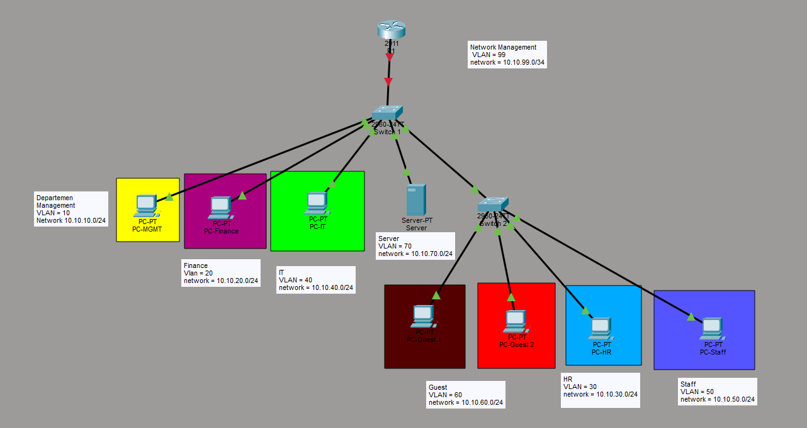

# Cisco Packet Tracer Network Simulation Project

## Overview

This repository contains a Cisco Packet Tracer network simulation project. The project is designed to demonstrate the planning, configuration, and testing of a computer network using Cisco networking devices in a simulated environment.

The main project file is:

```text
Project.pkt
```

This file can be opened using Cisco Packet Tracer.

## Project Objectives

The objectives of this project are:

- To design a computer network topology using Cisco Packet Tracer.
- To configure network devices such as routers, switches, and end devices.
- To apply IP addressing and basic network configuration.
- To test network connectivity between devices.
- To document the network design, configuration, and testing results.

## Tools Used

- Cisco Packet Tracer
- Cisco Router and Switch Devices
- End Devices such as PCs, laptops, or servers
- Command Line Interface \(CLI\) for device configuration

## Repository Structure

```text
.
├── Project.pkt
├── README.md
└── docs/
    ├── topology.png
    ├── ip-addressing-table.md
    └── testing-results.md
```

> Note: The `docs/` folder can be used to store screenshots, IP addressing tables, and testing evidence.

## Network Topology

The network topology is created inside Cisco Packet Tracer. The topology may include:

- Router devices
- Switch devices
- PC or laptop end devices
- Server devices
- Wired connections using Ethernet cables

Add a screenshot of your topology here:

```md

```

## IP Addressing Table

Use the table below to document the IP addresses used in the project.

| Device Name | Interface | IP Address | Subnet Mask | Default Gateway | Description |
|---|---|---:|---:|---:|---|
| PC0 | FastEthernet0 | `192.168.x.x` | `255.255.255.0` | `192.168.x.1` | End device |
| PC1 | FastEthernet0 | `192.168.x.x` | `255.255.255.0` | `192.168.x.1` | End device |
| Switch0 | VLAN 1 | `192.168.x.x` | `255.255.255.0` | `192.168.x.1` | Management IP |
| Router0 | GigabitEthernet0/0 | `192.168.x.1` | `255.255.255.0` | `-` | Gateway |

> Replace the example values with the actual IP addresses from your Packet Tracer project.

## Device Configuration Summary

Document the main configuration applied to each network device.

### Router Configuration

Example configuration:

```bash
enable
configure terminal
hostname Router0
interface gigabitEthernet0/0
ip address 192.168.1.1 255.255.255.0
no shutdown
exit
```

### Switch Configuration

Example configuration:

```bash
enable
configure terminal
hostname Switch0
interface vlan 1
ip address 192.168.1.2 255.255.255.0
no shutdown
exit
ip default-gateway 192.168.1.1
```

### PC Configuration

Each PC should be configured with:

- IP address
- Subnet mask
- Default gateway
- DNS server, if required

## Features Implemented

Update this section based on your actual project configuration.

- Basic LAN configuration
- Router interface configuration
- Switch management configuration
- IP addressing
- End-device connectivity
- Ping testing

Optional features if used:

- VLAN configuration
- Inter-VLAN routing
- DHCP configuration
- Static routing
- Dynamic routing
- NAT
- Access Control List \(ACL\)
- Server services such as DNS, DHCP, HTTP, or FTP

## Testing and Verification

Testing should be performed to ensure the network works correctly.

### Connectivity Test

Use the `ping` command from one device to another.

Example:

```bash
ping 192.168.1.1
ping 192.168.1.2
```

### Verification Commands

Useful Cisco CLI commands:

```bash
show ip interface brief
show running-config
show vlan brief
show ip route
show mac address-table
```

## Testing Results

| Test Case | Source Device | Destination Device | Expected Result | Actual Result | Status |
|---|---|---|---|---|---|
| Ping gateway | PC0 | Router0 | Success | Success | Passed |
| Ping between PCs | PC0 | PC1 | Success | Success | Passed |
| Check interface status | Router0 | - | Interface up | Interface up | Passed |

## How to Open the Project

1. Install Cisco Packet Tracer.
2. Clone or download this repository.
3. Open Cisco Packet Tracer.
4. Open the file:

```text
Project.pkt
```

5. Review the topology and device configurations.
6. Run connectivity testing using the simulation or realtime mode.

## Troubleshooting Notes

If the network does not work correctly, check the following:

- Make sure all interfaces are enabled using `no shutdown`.
- Check that every device has the correct IP address and subnet mask.
- Check the default gateway configuration on end devices.
- Check cable connections between devices.
- Use `show ip interface brief` to verify interface status.
- Use `ping` to test connectivity step by step.

## Conclusion

This project demonstrates how Cisco Packet Tracer can be used to design, configure, and test a simulated computer network. The documentation helps explain the network topology, addressing scheme, device configuration, and testing process.

## Author

Yohanes Marcel Krisna Mukti Wibowo
Informatics Student

## License

This project is created for educational purposes. You may modify and use it as a learning reference.
